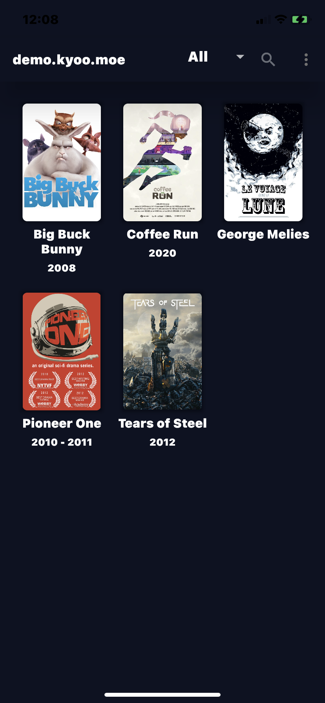
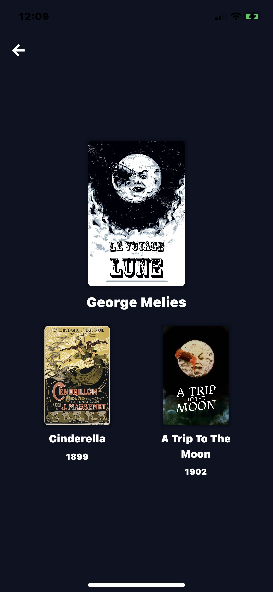
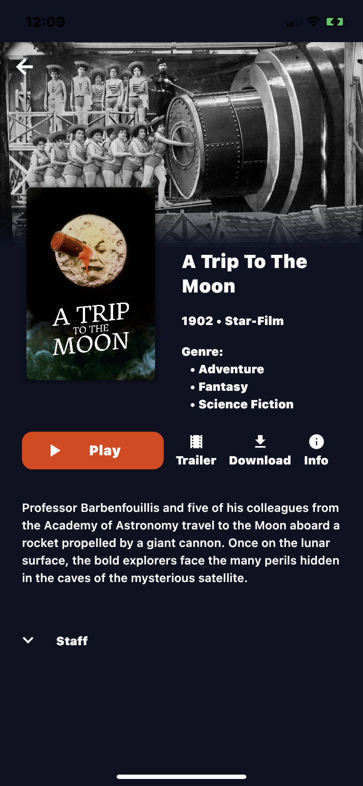
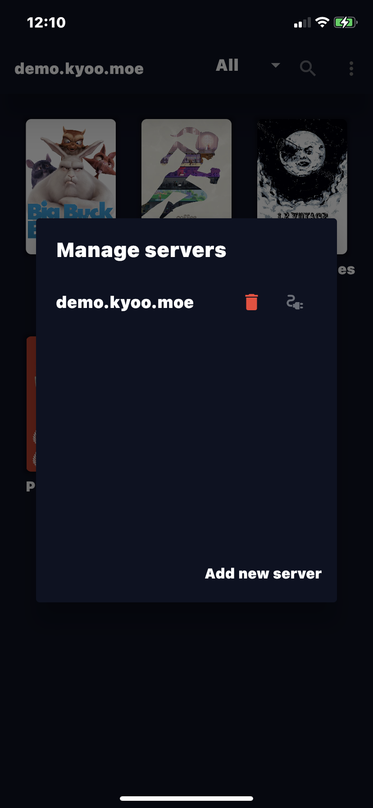

# Myoo: Mobile Client for your [Kyoo](https://github.com/AnonymusRaccoon/Kyoo) server

Watch your favorite movies & TV Series on the go with your personnal [Kyoo](https://github.com/AnonymusRaccoon/Kyoo) server

Working Android and iOS

## Features

- Watch Movie and TV Series
- Library sorting
- View trailer, download link and external ID
- Choose subtitles and streaming method
- Watch videos from multiple servers

## How to setup your server

Look over [here](https://docs.kyoo.moe/start/setting_up.html)!

## Quick views

